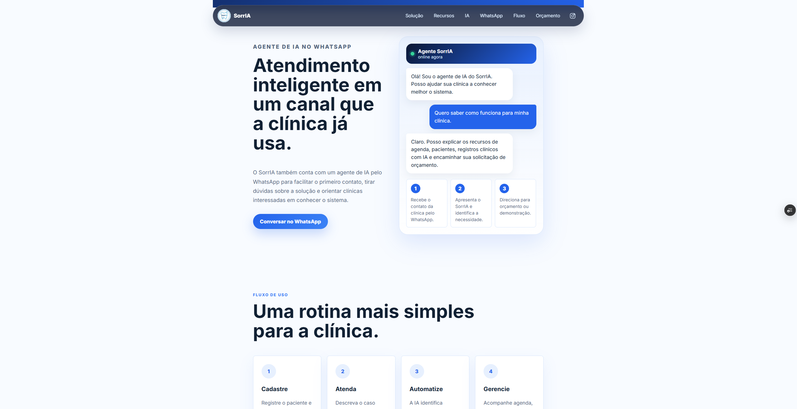

<div align="center">
  

  # SorrIA Landing Page

  Landing page do SorrIA, mini ERP odontológico com recursos de IA para apoio à gestão de clínicas odontológicas.

  **Acesse o projeto publicado:**  
  https://sorr-ia-landing.vercel.app/
</div>


## Sobre o projeto

A landing page apresenta o SorrIA, uma solução web voltada para clínicas odontológicas, com foco em gestão de pacientes, agenda, registros clínicos e uso de Inteligência Artificial para organizar informações do atendimento.

O objetivo da página é apresentar a proposta do sistema, demonstrar seus principais recursos e oferecer canais de contato para clínicas interessadas, incluindo WhatsApp e formulário de solicitação de orçamento.

## Funcionalidades da landing page

- Apresentação institucional do SorrIA.
- Seção explicando a proposta da solução.
- Cards com os principais recursos do mini ERP odontológico.
- Demonstração textual do uso de IA nos registros clínicos.
- Explicação do fluxo de uso da plataforma.
- Formulário de solicitação de orçamento.
- Envio de e-mail por função backend integrada ao Zoho Mail.
- Layout responsivo para desktop e mobile.

## Telas da Landing Page

### Tela inicial


### Solução


### Recursos


### Inteligência Artificial



### Fluxo de uso


### Formulário de orçamento


## Tecnologias utilizadas

| Tecnologia | Para que serve |
| --- | --- |
| HTML5 | Estrutura semântica da landing page. |
| CSS3 | Estilização, responsividade, cards, botões e identidade visual. |
| JavaScript | Interações da página, menu mobile e envio assíncrono do formulário. |
| Node.js | Execução do backend local. |
| Express | Servidor local para desenvolvimento e teste do formulário. |
| Nodemailer | Envio dos dados do formulário por e-mail. |
| Vercel Functions | Função serverless utilizada no deploy para processar `/api/orcamento`. |
| Zoho Mail SMTP | Serviço de e-mail usado para receber as solicitações de orçamento. |

## Rodar localmente

1. Instale as dependências:

```powershell
npm.cmd install
```

2. Crie um arquivo `.env` com base no `.env.example`.

3. Inicie o servidor local:

```powershell
npm.cmd start
```

4. Acesse:

```text
http://localhost:5600
```

## Variáveis de ambiente

Configure estas variáveis no `.env` local e também no Vercel:

```env
SMTP_HOST=smtp.zoho.com
SMTP_PORT=465
SMTP_USER=orcamento@sorriaerp.com.br
SMTP_PASS=sua_senha_de_app_do_zoho
MAIL_TO=orcamento@sorriaerp.com.br
```

Nunca envie o arquivo `.env` para o GitHub.

## Deploy no Vercel

1. Envie o projeto para um repositório no GitHub.
2. No Vercel, clique em `Add New Project`.
3. Importe o repositório do GitHub.
4. Em `Environment Variables`, cadastre as variáveis SMTP.
5. Clique em `Deploy`.

O formulário envia os dados para `/api/orcamento`, que no Vercel roda como uma função serverless.
