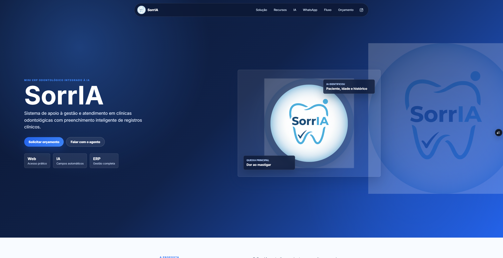
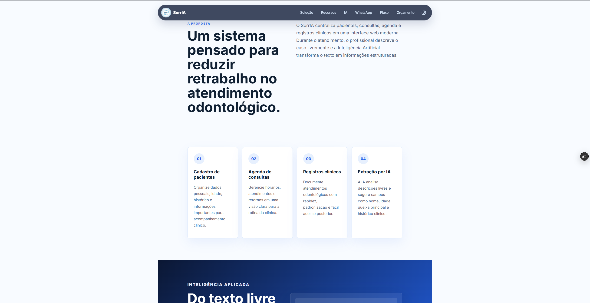
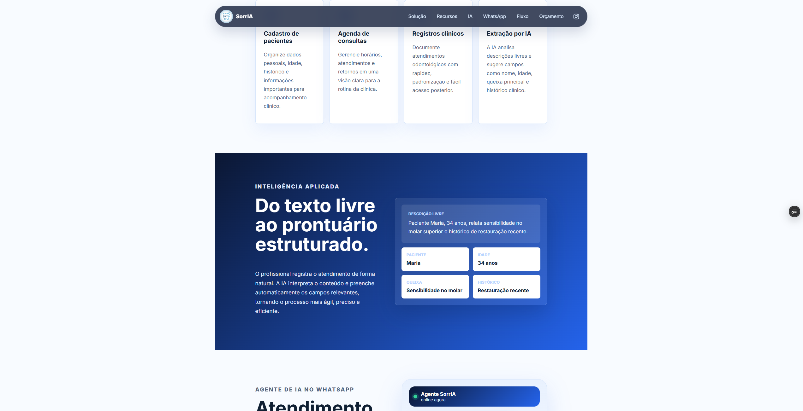
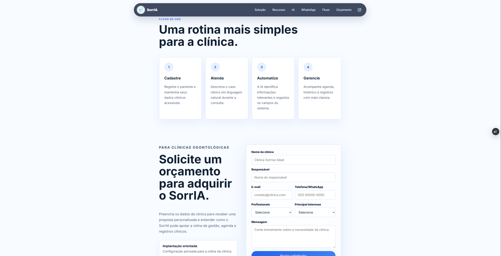

<div align="center">
  

  # SorrIA Landing Page

  Landing page do SorrIA, mini ERP odontologico com recursos de IA para apoio a gestao de clinicas odontologicas.

  **Acesse o projeto publicado:**  
  https://sorr-ia-landing.vercel.app/
</div>



## Sobre o projeto

A landing page apresenta o SorrIA, uma solucao web voltada para clinicas odontologicas, com foco em gestao de pacientes, agenda, registros clinicos e uso de Inteligencia Artificial para organizar informacoes do atendimento.

O objetivo da pagina e apresentar a proposta do sistema, demonstrar seus principais recursos e oferecer canais de contato para clinicas interessadas, incluindo WhatsApp e formulario de solicitacao de orcamento.

## Funcionalidades da landing page

- Apresentacao institucional do SorrIA.
- Secao explicando a proposta da solucao.
- Cards com os principais recursos do mini ERP odontologico.
- Demonstracao textual do uso de IA nos registros clinicos.
- Explicacao do fluxo de uso da plataforma.
- Formulario de solicitacao de orcamento.
- Envio de e-mail por funcao backend integrada ao Zoho Mail.
- Layout responsivo para desktop e mobile.

## Telas da Landing Page

### Tela inicial


### Solucao



### Recursos



### Inteligencia Artificial


### Fluxo de uso



### Formulario de orcamento


## Tecnologias utilizadas

| Tecnologia | Para que serve |
| --- | --- |
| HTML5 | Estrutura semantica da landing page. |
| CSS3 | Estilizacao, responsividade, cards, botoes e identidade visual. |
| JavaScript | Interacoes da pagina, menu mobile e envio assíncrono do formulario. |
| Node.js | Execucao do backend local. |
| Express | Servidor local para desenvolvimento e teste do formulario. |
| Nodemailer | Envio dos dados do formulario por e-mail. |
| Vercel Functions | Funcao serverless utilizada no deploy para processar `/api/orcamento`. |
| Zoho Mail SMTP | Servico de e-mail usado para receber as solicitacoes de orcamento. |

## Rodar localmente

1. Instale as dependencias:

```powershell
npm.cmd install
```

2. Crie um arquivo `.env` com base no `.env.example`.

3. Inicie o servidor local:

```powershell
npm.cmd start
```

4. Acesse:

```text
http://localhost:5600
```

## Variaveis de ambiente

Configure estas variaveis no `.env` local e tambem no Vercel:

```env
SMTP_HOST=smtp.zoho.com
SMTP_PORT=465
SMTP_USER=orcamento@sorriaerp.com.br
SMTP_PASS=sua_senha_de_app_do_zoho
MAIL_TO=orcamento@sorriaerp.com.br
```

Nunca envie o arquivo `.env` para o GitHub.

## Deploy no Vercel

1. Envie o projeto para um repositorio no GitHub.
2. No Vercel, clique em `Add New Project`.
3. Importe o repositorio do GitHub.
4. Em `Environment Variables`, cadastre as variaveis SMTP.
5. Clique em `Deploy`.

O formulario envia os dados para `/api/orcamento`, que no Vercel roda como uma funcao serverless.
